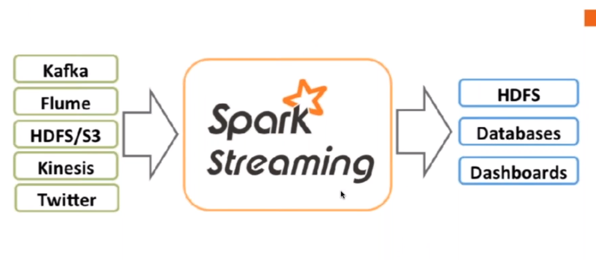
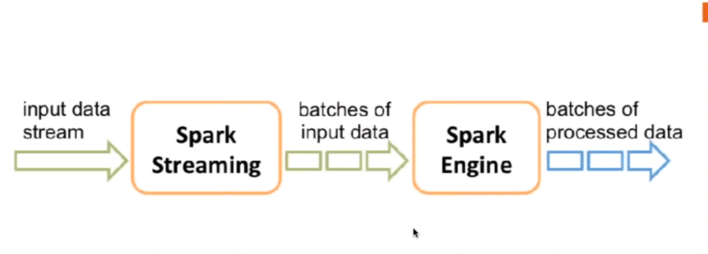
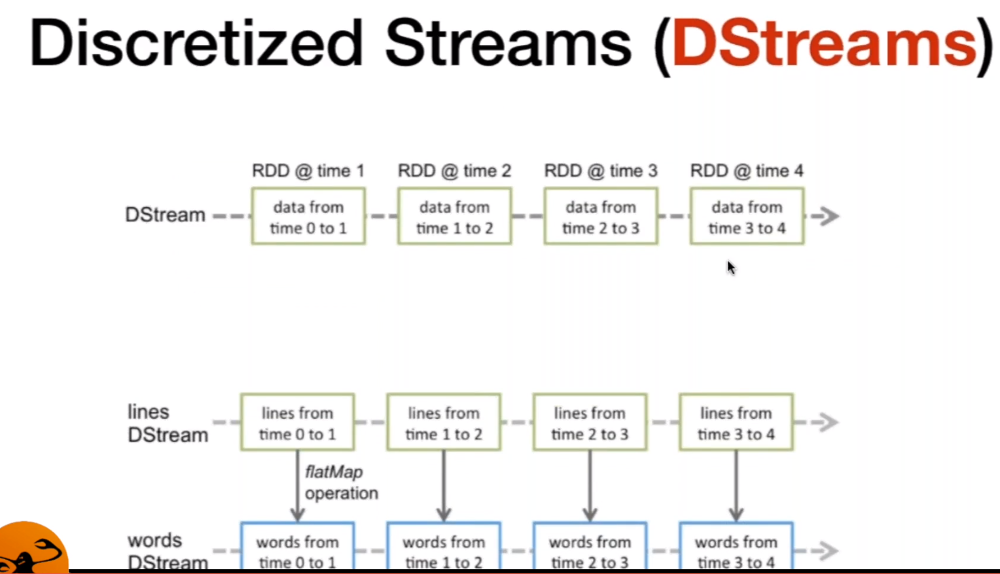
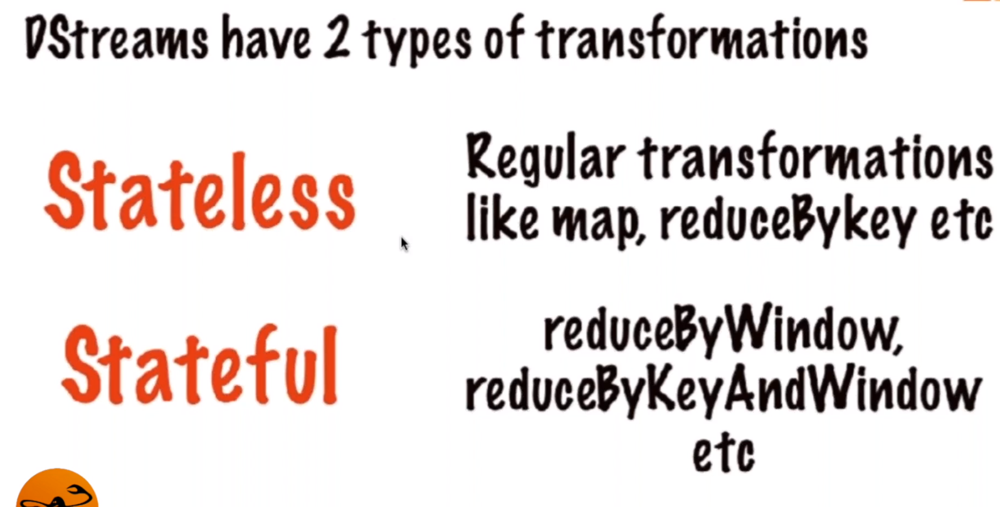
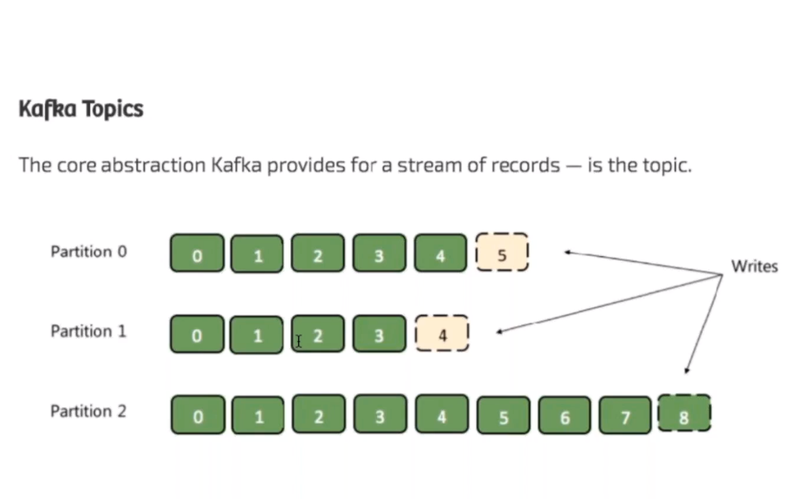
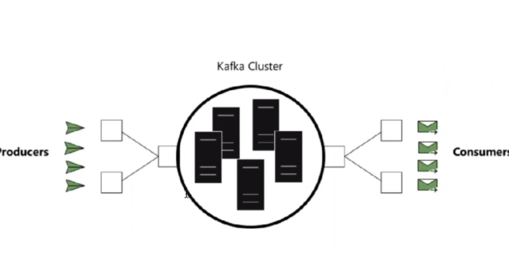
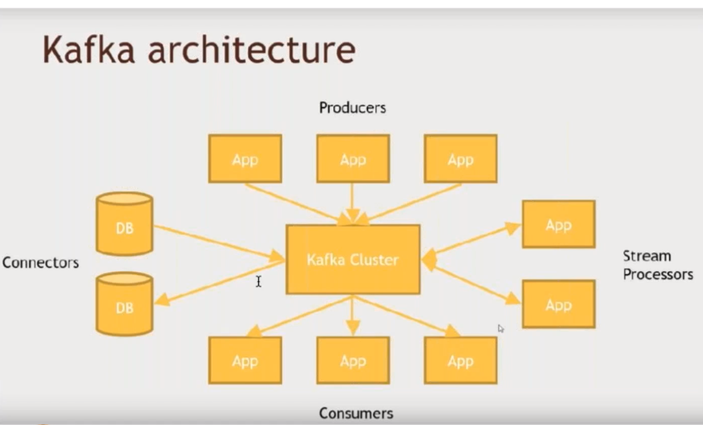
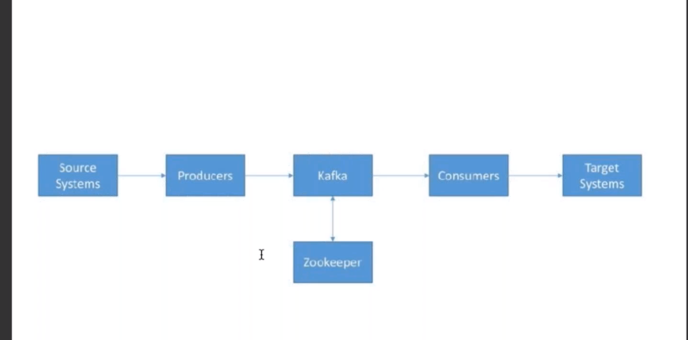

# 9 Spark Core y Real Time
1. [Spark Streaming ](#schema1)
2. [Apache Kafka ](#schema2)

# 1. Spark Streaming

# 2. Apache Kafka

Apache Kafka es una plataforma distribuida de transmisión de datos que permite publicar, almacenar y procesar flujos de registros, y suscribirse a ellos, en tiempo realEstá diseñada para manejar flujos de datos de varias fuentes y distribuirlos a los diversos usuarios.

El escalado es muy rápido. Los datos se van guardando en los kafkas, cada uno con su numeración.

La máquina que hace de director para todos los elementos de kafka se llama zookeeper, ayuda a controlar los clusters.

